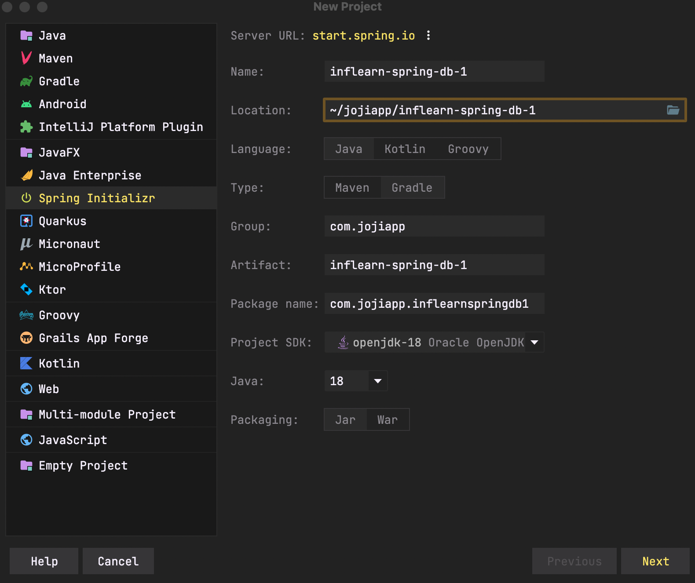
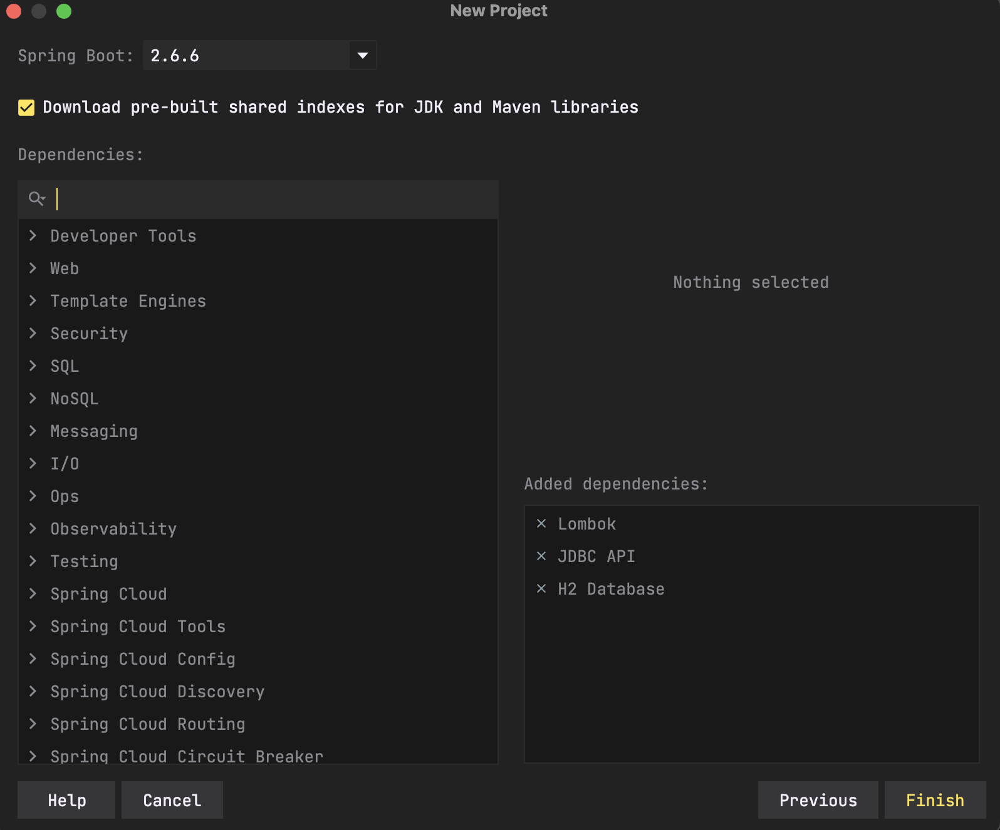

# Chapter 1. JDBC 이해

> `인프런`의 `김영한 강사`님의 `스프링 DB 1편 - 데이터 접근 핵심 원리` 강의를 보고 정리한 것 입니다.

## 1.1 프로젝트 생성




- `test`에서 `lombok`을 사용하기 위해 아래 두 줄을 `build.gradle`에 추가해줍니다.

```groovy
dependencies {
    // 테스트에서 lombok 사용
    testCompileOnly 'org.projectlombok:lombok'
    testAnnotationProcessor 'org.projectlombok:lombok'
}
```