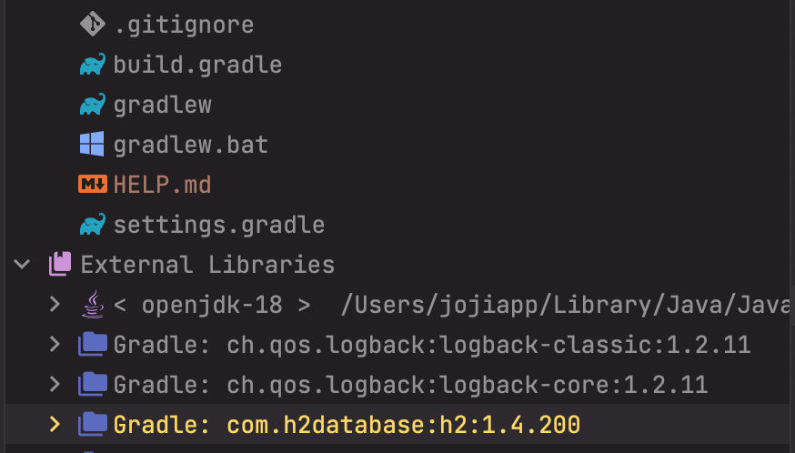
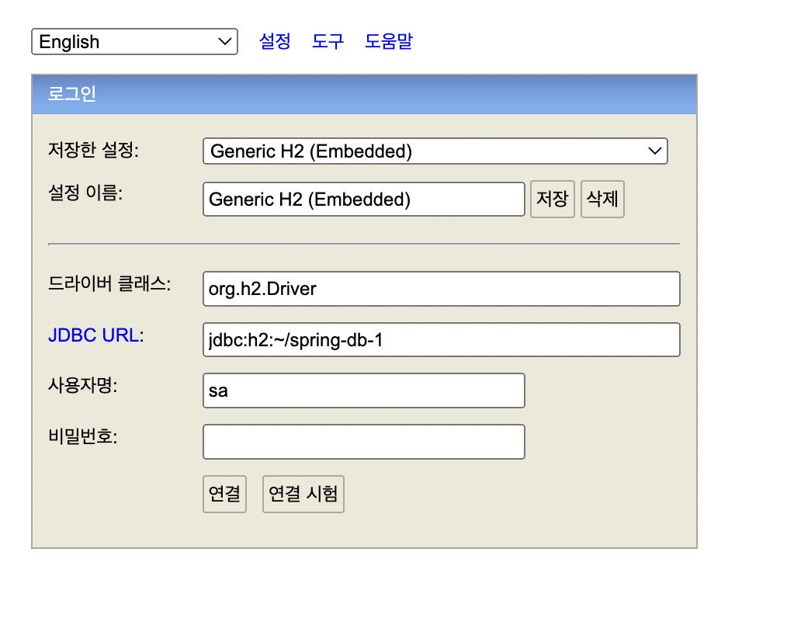
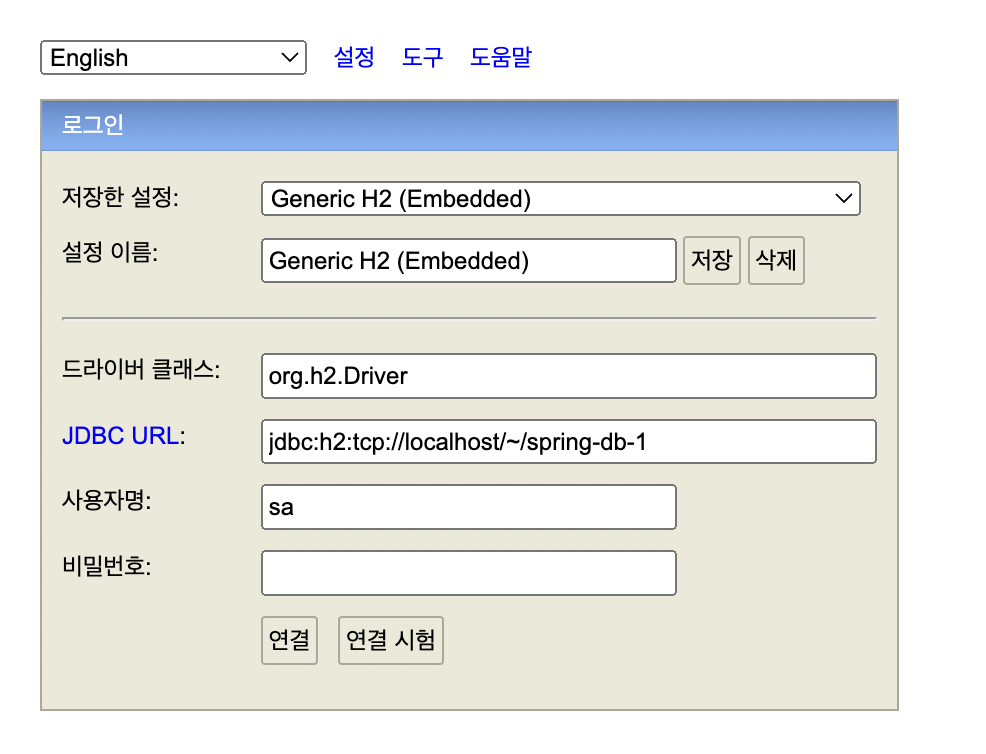

# Chapter 1. JDBC 이해

> `인프런`의 `김영한 강사`님의 `스프링 DB 1편 - 데이터 접근 핵심 원리` 강의를 보고 정리한 것 입니다.

- [1.1 프로젝트 생성](https://github.com/jojiapp/TIL/blob/master/spring/스프링-DB-1편-데이터-접근-핵심-원리/Chapter-1-JDBC-이해.md#11-프로젝트-생성)
- [1.2 H2 데이터베이스 설정](https://github.com/jojiapp/TIL/blob/master/spring/스프링-DB-1편-데이터-접근-핵심-원리/Chapter-1-JDBC-이해.md#12-H2-데이터베이스-설정)

## 1.1 프로젝트 생성


- `test`에서 `lombok`을 사용하기 위해 아래 두 줄을 `build.gradle`에 추가해줍니다.

```groovy
dependencies {
    // 테스트에서 lombok 사용
    testCompileOnly 'org.projectlombok:lombok'
    testAnnotationProcessor 'org.projectlombok:lombok'
}
```

## 1.2 H2 데이터베이스 설정

`H2 데이터베이스`는 개발이나 테스트 용도로 사용하기에 가벼운 `DB`입니다.

- build.gradle

```groovy
dependencies {
    runtimeOnly 'com.h2database:h2'
}
```

위의 `dependencies`를 추가하고 [H2 데이터베이스 공식 사이트](https://www.h2database.com/html/main.html)에서 다운로드 받습니다.

또는 `MacOS`의 경우 `homebrew`를 통해 다운로드 받을 수 있습니다.

```zsh
brew install h2
```

이때, 버전은 `dependencies`로 받아진 라이브러리 버전과 일치한 버전으로 받아야합니다.



`External Libraries`에서 `1.4.200` 버전인 것을 확인할 수 있습니다.

### 1.2.1 H2 데이터베이스 실행

다운로드가 되었다면 실행 시킨 후, 최초의 경우 `JDBC URL`에 `jdbc:h2:~/db이름`을 넣고 연결을 한 번 해주어야 합니다. (`DB 생성`)



`spring-db-1` 부분은 원하는 이름으로 설정하면 됩니다.

해당 파일은 `root`에 `해당 이름.mv.db` (`spring-db-1.mv.db`)로 생성 됩니다.

한 번 생성 했다면, 이후로는 `jdbc:h2:tcp://localhost/~/spring-db-1`으로 접속하면 됩니다.


